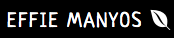
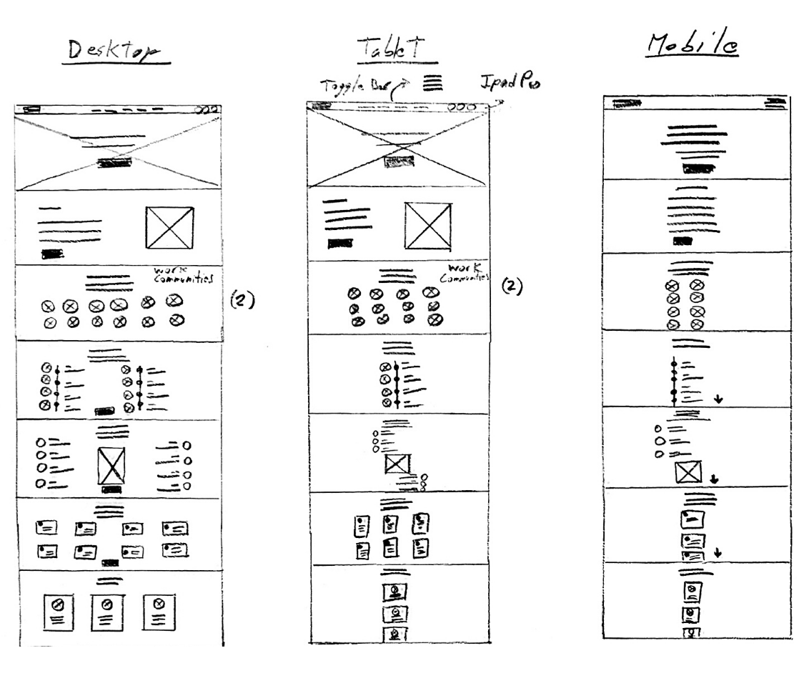

# **[Effie Manyos | Personal Website](https://effiemanyos.github.io/milestone-project-one/)**


**[VIEW WEBSITE LIVE](https://effiemanyos.github.io/milestone-project-one/)**

 

## **User Centric Front-End Development Milestone Project 1**

### **Project Overview**

This project consists of a **static front-end website** built to help **Entrepreneurs, Tech Startups, Small Businesses, Non-Profits, Entry-Level Professionals, Recent Graduates, Professional Expats** achieve their professional goals by providing them with the right tools. From a business perspective, this project is to **build a strategic professional online presence for the owner, promote and sell her services and online courses, build a community around the fields of interest, become an Irish thought leader, and build a solid personal branding resulting in a profitable business**. 

This project is the first milestone in obtaining a **[Full-Stack Web Development](https://codeinstitute.net/full-stack-software-development-diploma/) University-Rated Professional Diploma** from **[Code Institute](https://codeinstitute.net/)**. Only **HTML** and **CSS** were required for this project (**Bootstrap** was optional); however, other technologies were slightly used to improve the overall quality and user experience.

-------

# **CONTENT** 

- [Project Overview](#project-overview "Project Overview")
- [UX Design](#ux-design "UX Design")
  - [Strategy Plane](#strategy-plane "Strategy Plane")
    - [Target Audience](#target-audience "Target Audience")
    - [User Needs](#user-needs "User Needs")
    - [Business Goals](#business-goals "Business Goals")
    - [User Goals](#user-goals "User Goals")
    - [User Stories](#user-stories "User Stories")
    - [Unique Selling Proposition](#unique-selling-proposition "Unique Selling Proposition")
  - [Scope plane](#scope-plane "Scope plane")
    - [Existing Features](#existing-features "Existing Features")
    - [Future Iterations](#future-iterations "Future Iterations")
  - [Structure Plane](#structure-plane "Structure plane")
    - [Website Structure](#website-structure "Website Structure")
    - [Planned Structure](#planned-structure "Planned Structure")
    - [Future Additions](#future-additions "Future Additions")
  - [Skeleton Plane](#skeleton-plane "Skeleton Plane")
    - [Wireframes](#wireframes "Wireframes")
  - [Surface Plane](#surface-plane "Surface Plane")
    - [Typography](#typography "Typography")
    - [Color Scheme](#color-scheme "Color Scheme")
    - [Imagery](#imagery "Imagery")
- [Technologies Used](#technologies-used "Technologies Used")
- [Testing](#testing "Testing")
- [Deployment](#deployment "Deployment")
- [Credits](#credits "Credits")
- [Acknowledgements](#acknowledgements "Acknowledgements")

______

# **UX DESIGN**  

## **Strategy Plane** 
____

### **Target Audience**
- Entrepreneurs/Solopreneurs
- Tech Startups
- SMEs
- Non-Profits
- Mentees
- Entry-Level Professionals
- Recent Graduates
- Professional Expats

All working under the constraints of a **tight/no budget**.

**Countries:** Ireland (Residence), Spain (Origin), Peru (Origin)

**Age:** Not Specified (Yet)

### **User Needs**

These are some crucial **user pain points** worth mentioning:

- **Lack of in-house professionals** with enough experience or knowledge in an specific field.
- **Lack of strategic knowledge** in an specific field.
- **Lack of budget** to outsource certain tasks.
- **Lack of time** to invest in the managment of certain tasks.
- **Lack of clarity** in the overall strategy or even the ultimate goal of certain field.
- **Lack of ideas** on how to grow a business under a tight budget.
- **Lack of structure** in our processes which lead us to negative outcomes. 

### **What Are These Users Looking For? | Assumptions**

Consulting, Training, Strategy, Management, Guidance, Clarity, Structure, Mentoring, Speaking, Knowledge, Collaboration, Partnership, Free Resources, Networking, Development, Empowerment, Confidence.

This list leads to **GROW**/**LAUNCH** their businesses or **GROW** professionally. These are just assumptions that still need to be validated once we launch the MVP.

### **Business Goals**
Site Owner's Goals:
- Build my personal branding
- Develop a professional online presence
- Expand my networking opportunities
- Promote my services
- Showcase my work (portfolio)
- Get more interesting side projects
- Increase collaborations and partnerships
- Make my knowledge profitable (sell my courses/workshops)
- Increase my client base
- Become thought leader in Cork, then Ireland
- Help people grow their businesses
- Support Irish economy by helping boost the # of Irish startups
- Gain more professional experience in Ireland

### **User Goals**
External User's Goals:
- Find resources to learn and implement
- Find help to grow my business
- Find help to ideate and execute my business idea
- Get more customers without investing too much money
- Increase monthly sales and annual profit
- Improve my ROI and reduce churn
- Look for guidance and clarity for professional purposes
- Stay up to date with the latest trends and resources

### **User Stories**

**Target Audience:**
- As an **Entrepreneur/Solopreneur**, I want to **register** to Effie's **online workshop** so that I can boost my business' monthly sales.
- As a **Tech Startup**, I want to **use** Effie's **free online resources** so that we can create a robust Digital Marketing strategy.
- As a **SME**, I want to **book** a **free consultaiton** with Effie so that we can increase our business' online presence and engagement. 
- As a **Non-Profit**, I want to **contact** Effie for a **collaboration** and **consulting session** so that we can grow the organization organically.  
- As a **Mentee**, I want to **apply** to Effie's **mentorship program** so that I can get the proper guidance to build my professional career.
- As an **Entry-Level Professional**, I want to **join** Effie's **networking community** so that I can land my first full-time job faster through contacts.
- As a **Recent Graduate**, I want to **consume** Effie's **free courses and resources** so that I can launch my business idea.
- As a **Professional Expat**,I want to **learn** from Effie's successful journey so that I know where to start mine as a new international professional in Ireland.  

**Visitor Types:**

*First-Time Visitor:*
- As a **First Time Visitor**, I want to know **who Effie is** and what she does so that I can evaluate if I need her expertise to scale my business (SMEs)
- As a **First Time Visitor**, I want to know what **qualifications** Effie has so that I can use the resources she offers to increase my client base and profit (Entry-Level Professionals)
- As a **First Time Visitor**, I want to know what kind of **services** Effie offers so that I can come back whenever I need them to launch my business idea (Entrepreneurs)
- As a **First Time Visitor**, I want to Know **what other people say about Effie** so that I can hire her to manage my social media accounts (Solopreneurs)
- As a **First Time Visitor**, I want to know about Effie's **work experience** so that I can get in touch with her once I finish my studies (Recent Graduates)

*Returning Visitor:*
- As a **Returning Visitor**, I want to **make sure** Effie's **site is not a scam** so that I can pay for her services before the product launch (Tech Startups)
- As a **Returning Visitor**, I want to **contact** Effie so that we can work together on my business growth and retention rates (SMEs)
- As a **Returning Visitor**, I want to **book** Effie's **free consultation** so that I can create a solid Digital Marketing strategy for my business (Solopreneurs)
- As a **Returning Visitor**, I want to **call Effie directly** so that I can start working with her on my personal branding to get a corporate job in Ireland (Professional Expats)
- As a **Returning Visitor**, I want to **send Effie a message** so that I can be sure that she would be able to work on the product-market fit for my business idea (Recent Graduates)

*Frequent Visitor:*
- As a **Frequent Visitor**, I want to **register** to Effie's **upcoming online workshops and events** so that I can learn more marketing and business skills for my entrepreurial venue (Recent Graduate)
- As a **Frequent Visitor**, I want to **join Effie's community for expats (Huasi)** so that I can meet more connections to land my dream job faster (Professional Expats)
- As a **Frequent Visitor**, I want to **pay a monthly or annually subscription** so that I can always be up to date with the latest methods and frameworks for my business growth (Entrepreneurs)
- As a **Frequent Visitor**, I want to **pay online for Effie's services** so that I can reduce churn and increase product adoption and customer retention (Tech Startups)
- As a **Frequent Visitor**, I want to **get the freemium plan** so that I can use Effie's free resources and implement them to growth my business (Solopreneurs)

These are just some of the user stories that were created for this project. However, not all of these will be met due to an important reduction of the initial scope. The MVP is now more oriented to building brand awareness, confidence, trust and social proof. The features required by the **returning visitors** will be implemented by the second month after the launch of the MVP.

### **Unique Selling Proposition**

USPs or Core Differentiators:

**Service:**
- International experience working at tech startups, SMEs, and multinational corporations.
- International studies in various fields such as Marketing, Advertising, Business, Entrepreneurship, Product Management, Software Development.
- Vast experience working in multicultural teams both in English and Spanish.
- Experience mentoring and training individuals and small groups of people from different age ranges. 
- Speak fluently two of the most spoken languages in the world, Spanish and English.
- Have a deep passion for helping others succeed while growing personally and professionally during that proccess.
- Always up to date with the latest tools and methods in the mentioned fields.
- Open-minded professional who can easily adapt to each individual or organization's way of doing things.
- Data-driven, results-oriented, and customer-obssesed professional.
- Always resourceful and creative, with a lovely sense of humor, loads of patience and positive energy.

**Website Functionality:**
- Immediate Response (Chatbot)
- User-friendly
- 100% Responsive
- Free Resources
- Up-To-Date Content
- Networking Opportunities
- Recommended Partners Section
- Connection to Slack Communities (NetCork & Huasi)
- Notify Me by Email (Events, News, Resources, Courses)
- Login/Logout
- Membership Options (Monthly/Annual Subscription)
- Exclusive Content

[Back to Content](#content)

## **Scope Plane** 
____

### **Existing Features**

**About Me *"Page"*:**
- **About Me** → Users can see a brief summary of Effie's biography and who she is. Users are also able to get in touch with her by clicking on the CTA button "Let's Talk!".
- **Work Experience** → Users can see a high level description of Effie's work experience and are able to visit each company's official website by clicking on each logo. Users can also visit Effie's LinkedIn profile by clicking on the CTA button "View More".
- **Qualifications** → Users can see Effie's education and are able to visit each school's official website by clicking on each logo. Users can also visit Effie's LinkedIn profile by clicking on the CTA button "View More".
- **Communities** → Users can see the communities Effie is part of and are able to visit each community's official website by clicking on each logo.

**Services *"Page"*:**
- **Services Types** → Users can see the type of services Effie provides, and by clicking on the CTA button "Request Free Consultation", they are able to request a free consultation with her.
- **Services Fields** → Users can see Effie's services fields and are able to see at least **four** of the services' detailed description to have an idea of what she provides.

**Training *"Page"*:**
- **Learning Hub** → Users can see all the ways they can learn new theory and skills provided by Effie's team. 

**Contact *"Page"*:**
- **Contact Me Form** (*) → Users are able to fill out the form to contact Effie. However, the form is not fully functional at the moment.  
- **Contact Information** → Users can see Effie's location, mobile number, social media channels, and email. Users can contact her via any of those channels during the indicated opening hours. 

**Footer *Section*:**
- **Footer** → Users can see a brief summary of who Effie is and what she offers.
- **Social Media** Links → Users can visit Effie's social media channels by clicking on each icon.
- **Newsletter Quick Sign Up Form** (*) → Users can fill out a quick sign up form to receive Effie's monthly newsletter straight to their inbox.

>(*) Not fully functional at the moment

### **Future Iterations**

These are some of the features that still need to be implemented to have a fully working website as required by the owner: 

**Home *"Page"*:**
- Welcome Video or Hero Video
- Featured In or Partners Section
- Key Figures Section
- Instagram Feed Section
- Clients Section

**About *"Page"*:**
- Side Projects Section
- Volunteering Section

**Services *"Page"*:**
- Entrepreneurship Section
- Recommended Partners Section
- Case Studies Section

**Training *"Page"*:**
- Live Workshops Section
- Online Webinars Section
- Online Courses Section
- 1:1 & Group Sessions Section
- Podcast & YouTube Section
- Blog & Newsletter Section
- Virtual Meetups Section

**Resources *"Page"*:**
- Books & eBooks Section
- Blogs & Newsletters Section
- Podcasts & Clubhouse Section
- PPL/SM/YT Channels Section
- Free/Cheap Tools Section
- Other Resources Section

**Join Us *"Page"*:**
- Memberships (Plans & Pricing) Section
- Join Huasi Section
- Join NetCork Section
- P&C (Partnerships & Collaborations) Section

**Contact *"Page"*:**
- Calendly Integration ("Book a Call" or "Request Free Consultation")

**Other Features:**
- Blog
- Chatbot
- Pop Up Lead Magnet & Form
- Login/Logout (Navigation Bar)
- Restricted Access (Memership Plans)
- Membership Payment (Monthly & Annually)
- Functional Forms (Contact & Newsletter)
- Registration Forms (Events, Courses, Workshops...)
- Newsletter Long Form
- News & Upcoming Events
- Link Forms to Webserver (Data Collection)
- GDPR Compliance Cookies Policy
- Search (Website Content)
- Store (Merchandising)

Eventually, integrations or links to tools like Notion, Miro, Trello, Eventbrite, Slack, Google Calendar, Teachable might be included in the website.

[Back to Content](#content)

## **Structure Plane** 
____

### **Website Structure**

At the moment, the website consists in only **1 page containing 11 sections**, one after the other. The **current structure** of the website is the following:

|HOME|ABOUT|SERVICES|TRAINING|TESTIMONIALS|CONTACT|
|--|----|-----|---|---|---|
|Hero Image|About Me|How Can I Help|~~Learning Hub~~|Testimonials|Contact Me|
||Work Experience|What I Do|Communities|||
||Qualifications|||||

> Besides the 'Navigation' and 'Footer' section, which goes on top and after the 'Contact Me' section, respectively.

### **Planned Structure**

The **intended structure** of the website for the **MVP** was the following:

|HOME|ABOUT|SERVICES|TRAINING|RESOURCES|JOIN US|CONTACT|
|---|---|---|---|---|---|---|
|Hero Image |About Me|How Can I Help (*)|~~Learning Hub~~|Recommend Resources (^)|~~Memberships~~|Contact Me|
|About Me|~~Expertise~~|What I Do (**)|~~Workshops & Webinars~~|~~Books & eBooks~~|~~Join Huasi~~|Footer|
|How Can I Help (*)|Work Experience|Digital Marketing|~~Online Courses~~|~~Blogs & Newsletters~~|~~Join NetCork~~||
|What I Do (**)|Qualifications|Product Management|~~1:1 & Group Sessions~~|~~Podcasts & Clubhouse~~|~~P&C~~||
|Testimonials|Top Skills|~~Entrepreneurship~~|~~Podcast & YouTube~~|~~PPL/SM/YT Channels~~| ~~Contact Me~~||
|~~Key Figures~~|Communities|~~Recommended Partners~~|~~Blog & Newsletter~~|~~Free/Cheap Tools~~|Footer||
|Contact Me|Contact Me|Contact Me|~~Virtual Meetups~~|~~Other Resources~~||
|Footer|Footer|Footer|Footer|Footer||

>(*) Services types  
(**) Services fields  
(^) Summary of all the recommended types of resources 

Unfortunately, the **scope** had to be reduced and adjusted due to a lack of resources, which the most vital was **time**, and then **knowledge** to develop some sections and complex features.

### **Future Additions**

The sections that will be added in the near future are the following:

|HOME|ABOUT|SERVICES|TRAINING|RESOURCES|JOIN US|CONTACT|
|---|---|---|---|---|---|---|
|Welcome Video (#)|Side Projects|Entrepreneurship|Workshops & Webinars|Books & eBooks|Memberships|Book a Call (**)|
|Featured In (*)|Volunteering|Recommended Partners|Online Courses|Blogs & Newsletters|Join Huasi||
|Key Figures||Case Studies (Clients)|1:1 & Group Sessions|Podcasts & Clubhouse|Join NetCork||
|Instagram Feed|||Podcast & YouTube|PPL/SM/YT Channels|P&C||
|Clients|||Blog & Newsletter|Free/Cheap Tools||
||||Virtual Meetups|Other Resources (^)||

> (#) Welcome Video or Hero Video   
(*) 'Featured In' or 'Partners' section  
(**) [Calendly](https://calendly.com/) integration so that users can **book free consultations** without having to send an email or a message.     
(^) Communities, White Papers, Toolkits, Guides, Templates, Frameworks, Networking, Volunteering, Cheat Sheets, Infographics, Events, etc.    

Besides these sections, a **login/logout** feature will be implemented in the navigation bar so that users can access exclusive content provided to their chosen membership plan.    

This will also require the implementation of a feature that allows users to make **payments online** for their prefered subscription plan on a monthly or annually basis.

## **Skeleton Plane** 
____

### **Wireframes**

- **Dektop**
- **Tablet**
- **Mobile**


[Back to Content](#content)

## **Surface Plane** 
____

### **Typography**

Only two fonts were used for this project.

- **[Neucha](https://fonts.google.com/specimen/Neucha?query=Neucha&preview.text_type=custom)**, designed by Jovanny Lemonad, for all titles and subtitles.  
- **[Poppins](https://fonts.google.com/specimen/Poppins?query=Poppins&preview.text_type=custom)**, designed by Indian Type Foundry, Jonny Pinhorn, for all paragraphs.

**Font Styling:**

The following styling has been used for consistency and alignment throughout the entire website:
- **Titles (h1, h2):** 

```CSS
/* Main Titles Styling */
.titles {
    font-family: Neucha, Helvetica, sans-serif;
    font-size: 40px;
    letter-spacing: 4px;
    text-transform: uppercase;
    text-align: center;
}
```

- **Subtitles (h3, h4):**

```CSS
/* Subtitles Styling */
.subtitles {
    font-family: Neucha, Helvetica, sans-serif;
    font-size: 25px;
    letter-spacing: 1px;
}
```

- **Paragraphs (p):**

```CSS
/* Paragraphs Styling */
.paragraphs {
    font-family: Poppins, Helvetica, sans-serif;
    font-size: 16px;
}
```

- **CTA Buttons Text:**

```CSS
/* CTA Buttons Text Styling */
.cta-buttons {
    font-family: Poppins, Helvetica, sans-serif;
    text-transform: uppercase;
    font-size: 12px;
    letter-spacing: 1px;
    font-weight: 600;
}
```

### **Color Scheme**

According to an article on **[The Science of Colour Persuasion](https://idealogicbrandlab.com/color-persuasion/)** by **IDealogic® Brand Lab**:

Colour establishes **brand recognition** amongst consumers, therefore it is crucial that the same colours are always used across all channels, such as website, social media, advertising, product packaging, merchandising, etc.

The following are the colours used for this project:


**Primary Colours:**
> - **Purple** → Associated with **wisdom, wealth, spirituality, imaginative, and sophistication**.
> - **Black** → Associated with **sophistication, luxury, security, power, elegance, authority, and substance**.
> - **Green** → Associated with **health, tranquility, growth, freshness, prosperity, hope, balance, harmony, and nature**.
> - **Pink** → Associated with femininity. **Imaginative, passionate, caring, creativity, innovative, quirky**. 

At the end, only these colours were used throughout the entire website (MVP stage): 


### **Imagery**

Illustrations were taken from **[UnDraw](https://undraw.co/)** to improve the UX. These illustrations have been modified to match the website and brand colours.

Professional photographies from **[Unsplash](https://unsplash.com/)** have been used for the Hero Image, Work Experience and Testimonials section of the website. 

When ready, professional photos and videos will be added to the website in various sections. Some of the images and videos will come from:
- Workshops
- Events
- Webinars
- Collaborations
- Volunteering
- Owner's Promotional Photos

At the moment, the imagery used is for academic purposes only in order to meet the project deadline. These images will be replaced before the launch of the website.

[Back to Content](#content)

# **TECHNOLOGIES USED** 

The following technology was used during the development and testing of this project:

### **Languages**

- **HTML5** to structure each page.
- **CSS3** to style the elements within each page.

### **Workspaces, Version Control, Respository Hosting**
- Store Repositories → [GitHub](https://github.com/)
- Main Workspace → [Gitpod](https://www.gitpod.io/)
- Version Control → [Git](https://git-scm.com/)

### **Frameworks & Libraries**
- Frameworks → [Bootstrap V4.6.0](https://getbootstrap.com/)
- Fonts → [Google Fonts](https://fonts.google.com/)
- Icons → [Font Awesome V4.7.0](https://fontawesome.com/v4.7.0/icons/)

### **Code Consultations**
- Git Commit Messages → [Chris Beams | How to Write a Git Commit Message](https://chris.beams.io/posts/git-commit/)
- CSS Tricks → [CSS Tricks](https://css-tricks.com/)
- HTML/CSS → [W3Schools](www.w3schools.com)
- HTML/CSS → [Stack Overflow](https://stackoverflow.com/questions/10422949/css-background-opacity)
- Beautify HTML → [Web Formatter](https://webformatter.com/html)
- Beautify CSS → [Free Formatter](https://www.freeformatter.com/css-beautifier.html)
- Hex to RGB → [RapidTables](https://www.rapidtables.com/convert/color/hex-to-rgb.html)
- Rem to PX → [nekoCalc](https://nekocalc.com/rem-to-px-converter)
- Hover Effects → [Hover.css](https://ianlunn.github.io/Hover/)
- Website Icon → [Geeks For Geeks](https://www.geeksforgeeks.org/how-to-add-icon-logo-in-title-bar-using-html/) 
- Favicon → [W3C](https://www.w3.org/2005/10/howto-favicon) 

### **Testing Process**
- Test/Fix Code → [Chrome DevTools](https://developers.google.com/web/tools/chrome-devtools)
- Website Responsiveness → [Responsive Viewer](https://www.producthunt.com/posts/responsive-viewer)
- Website Performance → [Google Lighthouse](https://developers.google.com/web/tools/lighthouse)
- Validate HTML → [W3C HTML Validator](https://validator.w3.org/)
- Validate CSS → [W3C CSS Validator](https://jigsaw.w3.org/css-validator/)

https://wave.webaim.org/ 

### **Other Technologies**
- Mockup → [Responsive Design](http://ami.responsivedesign.is/)
- Mockup → [Techsini Mockup Generator](http://techsini.com/multi-mockup/)
- Unicode Symbols → [Cool Symbol](https://coolsymbol.com/)
- Illustrations → [UnDraw](https://undraw.co/)
- Photography → [Unsplash](https://unsplash.com/)
- Wireframing → [Balsamiq](https://balsamiq.com/) (*)
- Planning → [Miro](https://miro.com/)
- Visuals → [Canva](https://www.canva.com/)
- Colour Scheme → [Coolors](https://coolors.co/)
- Shapes & Diagrams → [Google Drawing](https://chrome.google.com/webstore/detail/google-drawings/mkaakpdehdafacodkgkpghoibnmamcme)
- Crop Portraits → [Crop Circle](https://crop-circle.imageonline.co/)
- Image Compression → [TinyJPG](https://tinyjpg.com/)

>(*) This tool was used to create the first version of wireframes. However, the structure and the design of the website had to be modified to meet the project deadline.

[Back to Content](#content)

# **TESTING**  

The entire testing process, issues and bugs found during development, solutions, and final results can be found [here](https://github.com/effiemanyos/milestone-project-one/blob/master/testing.md).

- Issues Solved During Development
- HTML-CSS Validation Testing
- Testing Performance
- Testing Accessibility
- Testing User Stories
- Code Institute Peer Code Review

[Back to Content](#content)

# **DEPLOYMENT**

### **GitHub Pages**

This project was deployed to **GitHub Pages** following these steps:

1. Login to **[GitHub](https://github.com/)**
2. Insert the following **GitHub Repository** name in the **Search Bar** to locate the project: **[effiemanyos/milestone-project-one](https://github.com/effiemanyos/milestone-project-one)**
3. Click on that repository to view more details
4. Click on **Settings**, which is located right above the **Gitpod** green button
5. Scroll all the way down to the **GitHub Pages** section
6. Under **Source**, select **Master** in the dropdown menu
7. Select **/(root)** in the tab which is right next to **Branch**
8. Click **Save** (*Note:* the page will automatically refresh)
9. Scroll all the way down again to the **GitHub Pages** section
10. Finally, you can see the link where the site is published highlited with a light green/blue background 

Follow these visual steps [here](https://github.com/effiemanyos/milestone-project-one/blob/master/assets/images/github-pages.png).

### **Run Project Locally**

1. Login to **[GitHub](https://github.com/)**
2. Insert the following **GitHub Repository** name in the **Search Bar** to locate the project: **[effiemanyos/milestone-project-one](https://github.com/effiemanyos/milestone-project-one)**
3. Select **Code** and click on **Download ZIP File**
4. You can extract the file and use it in your local environment once it is downloaded

### **Clone & Fork GitHub Repository**

Additionally, you can either **Clone** or **Fork** this repository ([Milestone-Project-One](https://github.com/effiemanyos/milestone-project-one)) into your [GitHub](https://github.com/) account by following these guides:
- **[Cloning a Repository](https://docs.github.com/en/github/creating-cloning-and-archiving-repositories/cloning-a-repository)**
- **[Fork a Repository](https://docs.github.com/en/github/getting-started-with-github/fork-a-repo)**

[Back to Content](#content)

# **CREDITS** 

### **Inspiration**
- [Sian Horn | The Club](https://sianhorn.com/)
- [Dana Fuelles](https://danafuelles.coach/)
- [Virginia Foley | Up She Rises](https://upsherises.ie/)
- [Wonsulting](https://wonsulting.com/)
- [Awwwards.](https://www.awwwards.com/)

### **Code**

- Preinstalled  Tools (Development) → [Code Institute Gitpod Full Template](https://github.com/Code-Institute-Org/gitpod-full-template)
- Favicon (UX) → [Geeks For Geeks](https://www.geeksforgeeks.org/how-to-add-icon-logo-in-title-bar-using-html/) 
- Spacing (Responsiveness) → [Boostrap](https://getbootstrap.com/docs/4.0/utilities/spacing/)
- Anchors (Fix Issue) → [Stack Overflow](https://stackoverflow.com/questions/10732690/offsetting-an-html-anchor-to-adjust-for-fixed-header)
- Metadata (SEO Purposes) → [W3Schools](https://www.w3schools.com/tags/tag_meta.asp)
- NavBar (Social Media Icons) → [CodeTime](https://www.youtube.com/watch?v=TT1faZ-g9U4) by Peter Medina and Trevor Greenleaf
- NavBar (Responsiveness) → [Bootstrap](https://getbootstrap.com/docs/4.0/components/navbar/)
- Scrollspy → [Bootstrap](https://getbootstrap.com/docs/5.0/components/scrollspy/)
- Hero Image → [W3Schools](https://www.w3schools.com/howto/howto_css_hero_image.asp)
- About Me Section (Grid System) → [Boostrap](https://getbootstrap.com/docs/4.0/layout/grid/)
- Work Eperience Section (Effect) → [How 2 Create](https://www.youtube.com/watch?v=uIADUUNJ4xg)
- Qualifications Section (Inspiration) → [Code Institute Resume Mini-Project](http://bit.ly/381pWFx)
- Qualifications Section (Timeline) → [DevPen](https://www.youtube.com/watch?v=TP4THzsAa3M)
- How Can I Help Section (Inspiration) → [Code Institute Love Running Mini-Project](http://bit.ly/37M38Jz)
- How Can I Help Section (Layout) → [Subrata Saha](https://www.youtube.com/watch?v=ZRouuWvN-7A)
- What I Do Section (Layout) → [Easy Tutorials](https://www.youtube.com/watch?v=JGGhAzUmjAQ) by Vikash and Avinash Kumar
- Testimonials Section (Layout) → [DarkCode](https://www.youtube.com/watch?v=zkyIVFoLxgY)
- Contact Me Section (Inspiration) → [True Coder](https://www.youtube.com/watch?v=rpujWVkmiPE)
- Contact Information (Email Link) → [Tutorials Point](https://www.tutorialspoint.com/html/html_email_links.htm)
- Footer Section (Layout) → [Divinector](https://www.youtube.com/watch?v=4jelwvPcS8w)

All these snippets of code have been fully customized for this project's requirements and to match the look and feel of the brand.

### **Media**

**'Hero Image' Section:**
- [New York, USA](https://unsplash.com/photos/VIhBOwitqu8) by [James Ting](https://unsplash.com/@jamesting) taken from [Unsplash](https://unsplash.com/)

**'About Me' Section:**
- Effie's Original Portraits by Effie Manyos taken from [LinkedIn](https://www.linkedin.com/in/effiemanyos/) and [Instagram](https://www.instagram.com/effiemanyos/) (2)

**'Work Experience' Section:**

*Company Logos:*
- [ArchHyve](https://archhyve.com/) Logo taken from Official Website
- [Ardagh Agencies](https://www.ardaghagencies.ie/) Logo taken from Official Website
- [ISG Contract](https://www.isgcontract.com/) Logo taken from Official Website
- [PeggyRain](https://peggyrain.com/) Logo taken from Official Website
- [Translit](https://translit.ie/) Logo taken from Official Website
- [Keysight Technologies](https://www.keysight.com/) Logo taken from Official Website
- [inbestMe](https://www.inbestme.com/en) Logo taken from Official Website
- [The Crêpe Kitchen](https://www.thecrepekitchen.ca/) Logo taken from Official Website
- [Citigroup](https://www.citigroup.com/citi/) Logo taken from Official Website
- [Banco de Credito BCP](https://www.viabcp.com/) Logo taken from Official Website
- [SocMark](https://www.linkedin.com/company/socmark/) Logo taken from Official Website
- [Publicidad Causa](http://pi-ar.com.pe/el-reto-de-las-agencias-de-hoy-conseguir-clientes-al-mismo-costo/) Logo taken from Google Images

*Location Images:*
- [Barcelona, Spain](https://unsplash.com/photos/fwi8RCxfmY4) by [Shai Pal](https://unsplash.com/@shaipal) taken from [Unsplash](https://unsplash.com/)
- [Toronto, Canada](https://unsplash.com/photos/_XYtu0lcVWo) by [Matthew Henry](https://unsplash.com/@matthewhenry) taken from [Unsplash](https://unsplash.com/)
- [Lima, Peru](https://unsplash.com/photos/4hMET7vYTAQ) by [Willian Justen de Vasconcellos](https://unsplash.com/@willianjusten) taken from [Unsplash](https://unsplash.com/)
- [New Jersey, USA](https://unsplash.com/photos/OWMN3ujgWBc) by [Gautam Krishnan](https://unsplash.com/@gautamkrishnan) taken from [Unsplash](https://unsplash.com/)
- [New York, USA](https://unsplash.com/photos/SVVTZtTGyaU) by [Patrick Tomasso](https://unsplash.com/@impatrickt) taken from [Unsplash](https://unsplash.com/)
- [Cork City, Ireland](https://unsplash.com/photos/NELRuCfHxxU) by [Mark de Jong](https://unsplash.com/@mrmarkdejong) taken from [Unsplash](https://unsplash.com/)

**'Qualifications' Section:**
- [Universitat de Barcelona](https://www.ub.edu/) Logo taken from Official Website
- [Wharton School | University of Pennsylvania](https://www.wharton.upenn.edu/) Logo taken from Official Website
- [University of Alberta](https://www.ualberta.ca/) Logo taken from Official Website
- [Digital Marketing Institute](https://digitalmarketinginstitute.com/) Logo taken from Official Website
- [Universidad de Lima](https://www.ulima.edu.pe/en) Logo taken from Official Website

**'How Can I Help' Section:**
- Illustration taken from [UnDraw](https://undraw.co/) and modified to match the brand and website color scheme.

**'Communities' Section:**
- [JCI Ireland](https://www.jciireland.ie/) Logo taken from Official Website
- [ThePowerMBA](https://thepowermba.com/) Logo taken from Official Website
- [Growth Hacking Course](https://www.growthhackingcourse.io/) Logo taken from Official Website
- [Sian Horn | The Club](https://sianhorn.com/) Logo taken from Official Website
- [IPMG](https://www.linkedin.com/company/irish-product-management-group/) Logo taken from Official Website
- [Product School](https://www.productschool.com/) Logo taken from Official Website
- [Product Buds](https://productbuds.co/) Logo taken from Official Website
- [Code Institute](https://codeinstitute.net/) Logo taken from Official Website
- [Women in Tech](https://women-in-tech.net/) Logo taken from Official Website
- [Up She Rises](https://upsherises.ie/) Logo taken from Official Website

**'Testimonials' Section:**
- [Portrait 1](https://unsplash.com/photos/TXxiFuQLBKQ) by [ThisisEngineering RAEng](https://unsplash.com/@thisisengineering) taken from [Unsplash](https://unsplash.com/)
- [Portrait 2](https://unsplash.com/photos/iFgRcqHznqg) by [Joseph Gonzalez](https://unsplash.com/@miracletwentyone) taken from [Unsplash](https://unsplash.com/)
- [Portrait 3](https://unsplash.com/photos/rriAI0nhcbc) by [Jack Finnigan](https://unsplash.com/@jackofallstreets) taken from [Unsplash](https://unsplash.com/)

[Back to Content](#content)

# **ACKNOWLEDGEMENTS** 

I would like to thank the following people for the constant support and guidance during my learning process: 
- [Cormac Lawlor (Tutor)](https://www.linkedin.com/in/cormac-lawlor/)
- [Adegbenga Adeye (Mentor)](https://www.linkedin.com/in/adegbenga-adeye-psm-i-14003635/)
- [Code Institute Slack Community](https://code-institute-room.slack.com/)
- [Igor Basuga (Tutor)](https://www.linkedin.com/in/igor-basuga-b2a123111/)
- [Miklos Sarosi (Tutor)](https://www.linkedin.com/in/miklossarosi/) 
- [Istvan Orosz (Classmate)](https://www.linkedin.com/in/istv%C3%A1n-orosz/) 

[Back to Content](#content)