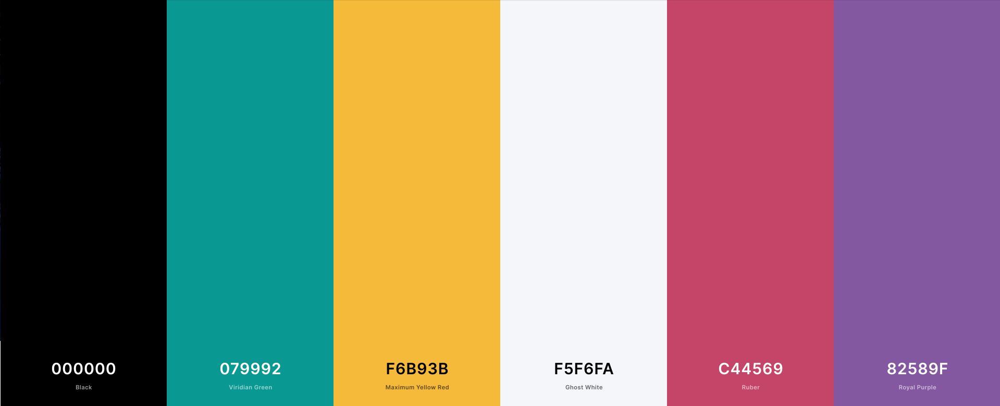
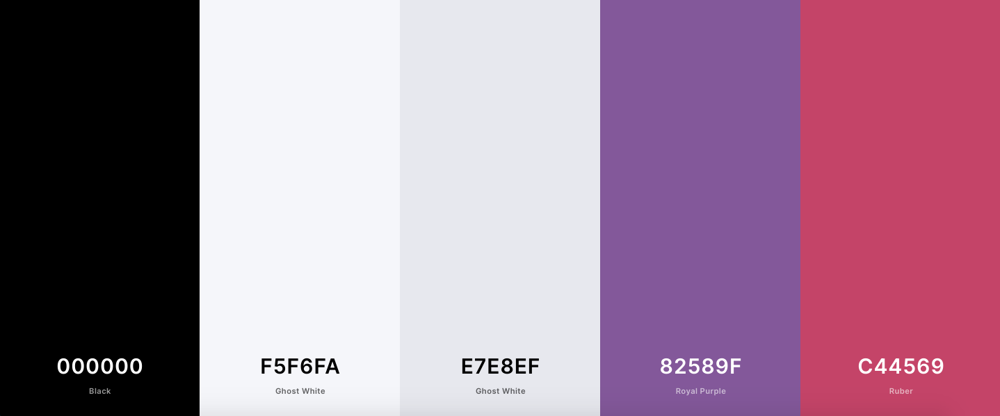

# **[EFFIE MANYOS PERSONAL WEBSITE](https://effiemanyos.github.io/first-personal-website/)**

**ADD LOGO + INTRODUCTION ABOUT PROJECT**

PROJECT DESCRIPTION & INTRODUCTION:
- Briefly introduce the project
- What's the motivation behind creating it
- What does it aim to solve and for whom

Static website to promote my services, increase my online presence and build a solid personal branding. This project is the first milestone in obtaining a [Full Stack Web Development](https://codeinstitute.net/full-stack-software-development-diploma/) diploma from [Code Institute](https://codeinstitute.net/).

-------

# **Content** 

- [Introduction](# "Introduction")
- [Demo](# "Demo")
- [UX Design](# "UX Design")
  - [Strategy Plane](# "Strategy Plane")
    - [Target Audience](# "Target Audience")
    - [User Needs & Assumptions](# "User Needs & Assumptions")
    - [Site Owner's Goals](# "Site Owner's Goals")
    - [External User's Goals](# "External User's Goals")
    - [User Stories](# "User Stories")
    - [Unique Selling Proposition](# "Unique Selling Proposition")
  - [Scope plane](# "Scope plane")
    - [Existing Features (MVP)](# "Existing Features (MVP)")
    - [Features to Implement (Iterations)](# "Future Iterations")
  - [Structure plane](# "Structure plane")
    - [Website Structure](# "Website Structure")
    - [Planned Structure](# "Planned Structure")
    - [Future Additions](# "Future Additions")
  - [Skeleton plane](# "Skeleton plane")
    - [Wireframes](# "Wireframes")
        - [Mobile](# "Mobile")
        - [Tablet](# "Tablet")
        - [Desktop](# "Desktop")
  - [Surface plane](# "Surface plane")
    - [Typography](# "Typography")
    - [Color Scheme](# "Color Scheme")
    - [Imagery](# "Imagery")
- [Technologies Used](# "Technologies Used")
    - [Languages](# "Languages")
    - [Workspaces, Version Control, Respository Hosting](# "Workspaces, Version Control, Respository Hosting")
    - [Frameworks & Libraries](# "Frameworks & Libraries")
    - [Code Consultations](# "Code Consultations")
    - [Testing](# "Testing")
    - [Other Technologies](# "Other Technologies")
- [Testing](# "Testing")
    - [Issues Solved Duringe Development](# "Issues Solved Duringe Development")
    - [Testing User Stories](# "Testing User Stories")
    - [Testing Accessibility](# "Testing Accessibility")
    - [Testing Performance](# "Testing Performance")
    - [HTML & CSS Validation](# "HTML & CSS Validation")
- [Deployment](# "Deployment")
    - GitHub Pages
    - Fork GitHub Repository
    - Local Clone
- [Credits](# "Credits")
    - [Inspiration](# "Inspiration")
    - [Code](# "Code")
    - [Media](# "Media")
- [Acknowledgements](# "Acknowledgements")

______

# **DEMO**  

**VIEW WEBSITE LIVE**


# **UX DESIGN**  

## **Strategy Plane** 
____

### **Target Audience**
- Entrepreneurs/Solopreneurs
- Tech Startups (Budget: Low/None)
- SMEs (Budget: Tight/Low)
- Non-Profits
- Mentees
- Entry-Level Professionals
- Recent Graduates

**Countries:** Ireland (Residence), Spain (Nationality), Peru (Origin)

**Age:** Not Specified (Yet)

### **User Needs**

These are some crucial **user pain points** worth mentioning:

- **Lack of in-house professionals** with enough experience or knowledge in an specific field.
- **Lack of strategic knowledge** in an specific field.
- **Lack of budget** to outsource certain tasks.
- **Lack of time** to invest in the managment of certain tasks.
- **Lack of clarity** in the overall strategy or even the ultimate goal of certain field.
- **Lack of ideas** on how to grow a business under a tight budget.
- **Lack of structure** in our processes which lead us to negative outcomes. 

### **Assumptions | What Are These Users Looking For?**

||||||
|-----|-----|-----|-----|-----|-----|-----|
|Consulting|Training|Strategy|Management|Guidance|
|Clarity|Structure|Mentoring|Speaking|Knowledge|
|Collaboration|Partnership|Resources|Networking|Development|

This list sums up to → **GROW** or **LAUNCH** their businesses and **GROW** professionally. These are just assumptions that still need to be validated.

### **Site Owner's Goals | Business Goals**
- Build my personal branding
- Develop a professional online presence
- Expand my networking opportunities
- Promote my services
- Showcase my work (portfolio)
- Get more interesting side projects
- Increase collaborations and partnerships
- Make my knowledge profitable (sell my courses/workshops)
- Increase my client base
- Become thought leader in Cork, then Ireland
- Help people grow their businesses
- Support Irish economy by helping boost the # of Irish startups
- Gain more professional experience in Ireland

### **External User's Goals**
- Find resources to learn and implement
- Find help to grow my business
- Find help to ideate and execute my business idea
- Get more customers without investing too much money
- Increase monthly sales and annual profit
- Improve my ROI and reduce churn
- Look for guidance and clarity for professional purposes
- Stay up to date with the latest trends and resources

### **User Stories**
"As a (type of user), I want to (perfom some task) so that I can (achieve some goal)."

**Target Audience:**
- As an **Entrepreneur/Solopreneur**, I want to **register** to Effie's **online workshop** so that I can boost my business' monthly sales (achieve some goal).
- As a **Tech Startup**, I want to **use** Effie's **free resources** so that we can create a robust Digital Marketing strategy.
- As a **SME**, I want to **book** a **free consultaiton** with Effie so that we can increase my business' online presence and engagement. 
- As a **Non-Profits**, I want to **contact** Effie for a **collaboration** and **consulting** so that we can grow the organization organically.  
- As a **Mentee**, I want to **apply** to her **mentorship program** so that I can get the proper guidance for my professional career.
- As an **Entry-Level Professional**, I want to **join** her **networking community** so that I can land my first full-time job faster through contacts.
- As a **Recent Graduate**, I want to **consume** Effie's **free training resources** so that I can launch my business idea.

**Visitors Type:**

*First-Time Visitor:*
- As a **First Time Visitor**, I want to know who she is and what she does so that I can evaluate if I need her to grow my business.
- As a **First Time Visitor**, I want to make sure this site is not a scam so that I can use these resources and services to increase my client base.

*Returning Visitor:*
- As a **Returning Visitor**, I want to contact Effie... 

These are just some of the user stories that were created for this project. However, not all of these will be met due to an important reduction of the initial scope.

### **Unique Selling Proposition (USP) | Core Differentiators**

**Service:**
- International experience working at tech startups, SMEs, and multinational corporations.
- International studies in various fields such as Marketing, Advertising, Business, Entrepreneurship, Product Management, Software Development.
- Vast experience working in multicultural teams both in English and Spanish.
- Experience mentoring and training individuals and small groups of people from different age ranges. 
- Speak fluently two of the most spoken languages in the world, Spanish and English.
- Have a deep passion for helping others succeed while growing personally and professionally during that proccess.
- Always up to date with the latest tools and methods in the mentioned fields.
- Open-minded professional who can easily adapt to each individual or organization's way of doing things.
- Data-driven, results-oriented, and customer-obssesed professional.
- Always resourceful and creative, with a lovely sense of humor, loads of patience and positive energy.

**Website Functionality:**
- Immediate Response (Chatbot)
- User-friendly
- 100% Responsive
- Free Resources
- Up-To-Date Content
- Networking Opportunities
- Recommended Partners Section
- Connection to Slack Communities (NetCork & Huasi)
- Notify Me by Email (Events, News, Resources, Courses)
- Login/Logout
- Membership Options (Monthly/Annual Subscription)
- Exclusive Content

## **Scope Plane** 
____

### **Existing Features | MVP**

**About Me *"Page"*:**
- **About Me** → Users can see a brief summary of Effie's biography and who she is. Users are also able to get in touch with her by clicking on the CTA button "Let's Talk!".
- **Work Experience** → Users can see a high level description of Effie's work experience and are able to visit each company's official website by clicking on each logo. Users can also visit Effie's LinkedIn profile by clicking on the CTA button "View More".
- **Qualifications** → Users can see Effie's education and are able to visit each school's official website by clicking on each logo. Users can also visit Effie's LinkedIn profile by clicking on the CTA button "View More".
- **Communities** → Users can see the communities Effie is part of and are able to visit each community's official website by clicking on each logo.

**Services *"Page"*:**
- **Services Types** → Users can see the type of services Effie provides, and by clicking on the CTA button "Request Free Consultation", they are able to request a free consultation with her.
- **Services Fields** → Users can see Effie's services fields and are able to see at least **four** of the services' detailed description to have an idea of what she provides.

**Training *"Page"*:**
- **Learning Hub** → Users can see all the ways they can learn new theory and skills provided by Effie's team. 

**Contact *"Page"*:**
- **Contact Me Form** (*) → Users are able to fill out the form to contact Effie. However, the form is not fully functional at the moment.  
- **Contact Information** → Users can see Effie's location, mobile number, social media channels, and email. Users can contact her via any of those channels during the indicated opening hours. 

**Footer *Section*:**
- **Footer** → Users can see a brief summary of who Effie is and what she offers.
- **Social Media** Links → Users can visit Effie's social media channels by clicking on each icon.
- **Newsletter Quick Sign Up Form** (*) → Users can fill out a quick sign up form to receive Effie's monthly newsletter straight to their inbox.

>(*) Not fully functional at the moment

### **Features to Implement | Future Iterations**

These are some of the features that still need to be implemented to have a fully working website as required by the owner: 

**Home *"Page"*:**
- Welcome Video or Hero Video
- Featured In or Partners Section
- Key Figures Section
- Instagram Feed Section
- Clients Section

**About *"Page"*:**
- Side Projects Section
- Volunteering Section

**Services *"Page"*:**
- Entrepreneurship Section
- Recommended Partners Section
- Case Studies Section

**Training *"Page"*:**
- Live Workshops Section
- Online Webinars Section
- Online Courses Section
- 1:1 & Group Sessions Section
- Podcast & YouTube Section
- Blog & Newsletter Section
- Virtual Meetups Section

**Resources *"Page"*:**
- Books & eBooks Section
- Blogs & Newsletters Section
- Podcasts & Clubhouse Section
- PPL/SM/YT Channels Section
- Free/Cheap Tools Section
- Other Resources Section

**Join Us *"Page"*:**
- Memberships (Plans & Pricing) Section
- Join Huasi Section
- Join NetCork Section
- P&C (Partnerships & Collaborations) Section

**Contact *"Page"*:**
- Calendly Integration ("Book a Call" or "Request Free Consultation")

**Other Features:**
- Blog
- Chatbot
- Pop Up Lead Magnet & Form
- Login/Logout (Navigation Bar)
- Restricted Access (Memership Plans)
- Membership Payment (Monthly & Annually)
- Functional Forms (Contact & Newsletter)
- Registration Forms (Events, Courses, Workshops...)
- Newsletter Long Form
- News & Upcoming Events
- Link Forms to Webserver (Data Collection)
- GDPR Compliance Cookies Policy
- Search (Website Content)
- Store (Merchandising)

Eventually, integrations or links to tools like Notion, Miro, Trello, Eventbrite, Slack, Google Calendar, Teachable might be included in the website.

## **Structure Plane** 
____

### **Website Structure**

At the moment, the website consists in only **1 page containing 11 sections**, one after the other. The **current structure** of the website is the following:

|HOME|ABOUT|SERVICES|TRAINING|TESTIMONIALS|CONTACT|
|--|----|-----|---|---|---|
|Hero Image √|About Me √|How Can I Help √|Learning Hub X|Testimonials √|Contact Me √|
||Work Experience √|What I Do √|Communities √|||
||Qualifications √|||||

> Besides the 'Footer' section, which goes after the 'Contact Me' section.

### **Planned Structure**

The **intended structure** of the website for the **MVP** was the following:

|HOME|ABOUT|SERVICES|TRAINING|RESOURCES|JOIN US|CONTACT|
|---|---|---|---|---|---|---|
|Hero Image √ |About Me √|How Can I Help (*) √|Learning Hub X|Recommend Resources (^) √|Memberships X|Contact Me √|
|About Me √|Expertise #|What I Do (**) √|Workshops & Webinars X|Books & eBooks X|Join Huasi X|Footer √|
|How Can I Help (*) √|Work Experience √|Digital Marketing √|Online Courses X|Blogs & Newsletters X|Join NetCork X||
|What I Do (**) √|Qualifications √|Product Management √|1:1 & Group Sessions X|Podcasts & Clubhouse X|P&C X||
|Testimonials √|Top Skills √|Entrepreneurship X|Podcast & YouTube X|PPL/SM/YT Channels X| Contact Me √||
|Key Figures X|Communities √|Recommended Partners X|Blog & Newsletter X|Free/Cheap Tools X|Footer √||
|Contact Me √|Contact Me √|Contact Me √|Virtual Meetups X|Other Resources X||
|Footer √|Footer √|Footer √|Footer √|Footer √||

>(*) Services types  
(**) Services fields  
(^) Summary of all the recommended types of resources 

Unfortunately, the **scope** had to be reduced and adjusted due to a lack of resources, which the most vital was **time**, and then **knowledge** to develop some sections and complex features.

### **Future Additions**

The sections that will be added in the near future are the following:

|HOME|ABOUT|SERVICES|TRAINING|RESOURCES|JOIN US|CONTACT|
|---|---|---|---|---|---|---|
|Welcome Video (#)|Side Projects|Entrepreneurship|Workshops & Webinars|Books & eBooks|Memberships|Book a Call (**)|
|Featured In (*)|Volunteering|Recommended Partners|Online Courses|Blogs & Newsletters|Join Huasi||
|Key Figures||Case Studies (Clients)|1:1 & Group Sessions|Podcasts & Clubhouse|Join NetCork||
|Instagram Feed|||Podcast & YouTube|PPL/SM/YT Channels|P&C||
|Clients|||Blog & Newsletter|Free/Cheap Tools||
||||Virtual Meetups|Other Resources (^)||

> (#) Welcome Video or Hero Video   
(*) 'Featured In' or 'Partners' section  
(**) [Calendly](https://calendly.com/) integration so that users can **book free consultations** without having to send an email or a message.     
(^) Communities, White Papers, Toolkits, Guides, Templates, Frameworks, Networking, Volunteering, Cheat Sheets, Infographics, Events, etc.    

Besides these sections, a **login/logout** feature will be implemented in the navigation bar so that users can access exclusive content provided to their chosen membership plan.    

This will also require the implementation of a feature that allows users to make **payments online** for their prefered subscription plan on a monthly or annually basis.

## **Skeleton Plane** 
____

### **Wireframes**

- **Mobile**
- **Tablet**
- **Desktop**

## **Surface Plane** 
____

### **Typography**

Only two fonts were used for this project.

- **[Neucha](https://fonts.google.com/specimen/Neucha?query=Neucha&preview.text_type=custom)**, designed by Jovanny Lemonad, for all titles and subtitles.  
- **[Poppins](https://fonts.google.com/specimen/Poppins?query=Poppins&preview.text_type=custom)**, designed by Indian Type Foundry, Jonny Pinhorn, for all paragraphs.

**Font Styling:**

The following styling has been used for consistency and alignment throughout the entire website:
- **Titles (h1, h2):** 

```CSS
/* Main Titles Styling */
.titles {
    font-family: Neucha, Helvetica, sans-serif;
    font-size: 40px;
    letter-spacing: 4px;
    text-transform: uppercase;
    text-align: center;
}
```

- **Subtitles (h3, h4):**

```CSS
/* Subtitles Styling */
.subtitles {
    font-family: Neucha, Helvetica, sans-serif;
    font-size: 25px;
    letter-spacing: 1px;
}
```

- **Paragraphs (p):**

```CSS
/* Paragraphs Styling */
.paragraphs {
    font-family: Poppins, Helvetica, sans-serif;
    font-size: 16px;
}
```

- **CTA Buttons Text:**

```CSS
/* CTA Buttons Text Styling */
.paragraphs {
    font-family: Poppins, Helvetica, sans-serif;
    text-transform: uppercase;
    font-size: 12px;
    letter-spacing: 1px;
    font-weight: 600;
}
```

### **Color Scheme**

According to an article on **[The Science of Colour Persuasion](https://idealogicbrandlab.com/color-persuasion/)** by **IDealogic® Brand Lab**:

Colour establishes **brand recognition** amongst consumers, therefore it is crucial that the same colours are always used across all channels, such as website, social media, advertising, product packaging, merchandising, etc.

The following are the colours used for this project:



**Primary Colours:**
> - **Purple** → Associated with **wisdom, wealth, spirituality, imaginative, and sophistication**.
> - **Black** → Associated with **sophistication, luxury, security, power, elegance, authority, and substance**.
> - **Green** → Associated with **health, tranquility, growth, freshness, prosperity, hope, balance, harmony, and nature**.
> - **Pink** → Associated with femininity. **Imaginative, passionate, caring, creativity, innovative, quirky**. 

At the end, only these colours were used throughout the entire website (MVP stage): 



### **Imagery**

Illustrations from **[UnDraw](https://undraw.co/)** have been used to improve the UX. These illustrations have been modified to match the website and brand colours.

CHANGE THIS - Professional photographies from **[Unsplash](https://unsplash.com/)** have been used to represent the owner's origins. All the selected images, except for the hero image, were taken in Peru, South America.

When ready, professional photos will be added to the website in various sections. Some of the images will come from:
- Workshops
- Events
- Webinars
- Collaborations
- Volunteering
- Owner's Promotional Photos

At the moment, the imagery used is for academic purposes only in order to meet the project deadline. These images will be replaced before the launch of the website.

# **TECHNOLOGIES USED** 

The following technology was used during the development and testing of this project:

### **Languages**

- **HTML5** to structure each page.
- **CSS3** to style the elements within each page.

### **Workspaces, Version Control, Respository Hosting**
- Store Repositories → [GitHub](https://github.com/)
- Main Workspace → [Gitpod](https://www.gitpod.io/)
- Version Control → [Git](https://git-scm.com/)

### **Frameworks & Libraries**
- Frameworks → [Bootstrap V4.2.1](https://getbootstrap.com/)
- Fonts → [Google Fonts](https://fonts.google.com/)
- Icons → [Font Awesome V4.7.0](https://fontawesome.com/v4.7.0/icons/)

### **Code Consultations**
- Git Commit Messages → [Chris Beams | How to Write a Git Commit Message](https://chris.beams.io/posts/git-commit/)
- CSS Tricks → [CSS Tricks](https://css-tricks.com/)
- HTML/CSS → [W3Schools](www.w3schools.com)
- HTML/CSS → [Stack Overflow](https://stackoverflow.com/questions/10422949/css-background-opacity)
- Beautify HTML → [Web Formatter](https://webformatter.com/html)
- Beautify CSS → [Free Formatter](https://www.freeformatter.com/css-beautifier.html)
- Hex to RGB → [RapidTables](https://www.rapidtables.com/convert/color/hex-to-rgb.html)
- Rem to PX → [nekoCalc](https://nekocalc.com/rem-to-px-converter)
- Hover Effects → [Hover.css](https://ianlunn.github.io/Hover/)
- Website Icon → [Geeks For Geeks](https://www.geeksforgeeks.org/how-to-add-icon-logo-in-title-bar-using-html/) 
- Favicon → [W3C](https://www.w3.org/2005/10/howto-favicon) 

### **Testing**
- Test/Fix Code → [Chrome DevTools](https://developers.google.com/web/tools/chrome-devtools)
- Website Responsiveness → [Responsive viewer](https://www.producthunt.com/posts/responsive-viewer)
- Website Performance → [Google Lighthouse](https://developers.google.com/web/tools/lighthouse)
- Validate HTML → [W3C HTML Validator](https://validator.w3.org/)
- Validate CSS → [W3C CSS Validator](https://jigsaw.w3.org/css-validator/)

### **Other Technologies**
- Mockup → [Responsive Design](http://ami.responsivedesign.is/)
- Mockup → [Techsini Mockup Generator](http://techsini.com/multi-mockup/)
- Unicode → [Cool Symbol](https://coolsymbol.com/)
- Illustrations → [UnDraw](https://undraw.co/)
- Photography → [Unsplash](https://unsplash.com/)
- Wireframing → [Balsamiq](https://balsamiq.com/)
- Planning → [Miro](https://miro.com/)
- Visuals → [Canva](https://www.canva.com/)
- Colour Scheme → [Coolors](https://coolors.co/)
- Shapes & Diagrams → [Google Drawing](https://chrome.google.com/webstore/detail/google-drawings/mkaakpdehdafacodkgkpghoibnmamcme)
- Crop Portraits → [Crop Circle](https://crop-circle.imageonline.co/)

# **TESTING**  

### **Issues Solved Duringe Development**
### **Testing User Stories**
### **Testing Accessibility**
### **Testing Performance (Google Lighthouse)**
### **HTML & CSS Validation**

The entire testing process, issues and bugs found, solutions, and final results can be found here.

# **Deployment**

### **GitHub Pages**

This project was deployed to **GitHub Pages** following these steps:

1. Login to **[GitHub](https://github.com/)**
2. Insert the following **GitHub Repository** in the **Search Bar** to locate it: **effiemanyos/milestone-project-one**
3. Click on that repository to view more details
4. Click on **Settings**, which is located right above the **Gitpod** green button
5. Scroll all the way down to the **GitHub Pages** section
6. Under **Source**, select **Master** in the dropdown menu
7. Select **/(root)** in the tab which is right next to **Branch**
8. Click **Save** (*Note:* the page will automatically refresh)
9. Scroll all the way down again to the **GitHub Pages** section
10. Finally, you can see the link where the site is published highlited with a light green/blue background 


# **CREDITS** 

### **Inspiration**
- [Sian Horn](https://sianhorn.com/)
- [Dana Fuelles](https://danafuelles.coach/)
- [Wonsulting](https://wonsulting.com/)
- [Awwwards.](https://www.awwwards.com/)

### **Code**

- Preinstalled  Tools → [Code Institute Gitpod Full Template](https://github.com/Code-Institute-Org/gitpod-full-template)
- XXXX
- XXXX
- XXXX
- Favicon → [Geeks For Geeks](https://www.geeksforgeeks.org/how-to-add-icon-logo-in-title-bar-using-html/) 

### **Media**

**'Hero Image' Section:**
- [Background Image](https://www.jciireland.ie/) by XXXX taken from [Unsplash](https://unsplash.com/)

**'About Me' Section:**
- [Background Image](https://www.jciireland.ie/) by XXXX taken from [Unsplash](https://unsplash.com/)
- Llama https://unsplash.com/photos/73FOXT1DvjI
- Islas Ballestas https://unsplash.com/photos/sCYqkY_Lmpo
- Miraflores Malecon https://unsplash.com/photos/Yrqyn1Gb80k
- https://unsplash.com/photos/4hMET7vYTAQ
- Lima Ciudad Mar https://unsplash.com/photos/lvowu4IK6Mc 
- https://unsplash.com/photos/Ef32LHjkw64
- https://unsplash.com/photos/sDRNwsezLU8
- https://unsplash.com/photos/WVC6iAZHP0k
- cusco mp right https://unsplash.com/photos/dZgMUPACJzQ

**'How Can I Help' Section:**
- Illustration taken from [UnDraw](https://undraw.co/) and modified to match the website and brand colours.

**'Work Experience' Section:**
- [ArchHyve](https://archhyve.com/) Logo
- [Ardagh Agencies](https://www.ardaghagencies.ie/) Logo
- [ISG Contract](https://www.isgcontract.com/) Logo
- [PeggyRain](https://peggyrain.com/) Logo
- [Translit](https://translit.ie/) Logo
- [Keysight Technologies](https://www.keysight.com/) Logo
- [Citigroup](https://www.citigroup.com/citi/) Logo
- [Banco de Credito BCP](https://www.viabcp.com/) Logo
- [SocMark](https://www.linkedin.com/company/socmark/) Logo
- [Publicidad Causa](http://pi-ar.com.pe/el-reto-de-las-agencias-de-hoy-conseguir-clientes-al-mismo-costo/) Logo

**'Qualifications' Section:**
- [Universitat de Barcelona](https://www.ub.edu/) Logo
- [Wharton | University of Pennsylvania](https://www.wharton.upenn.edu/) Logo
- [University of Alberta](https://www.ualberta.ca/) Logo

**'Communities' Section:**
- [JCI Ireland](https://www.jciireland.ie/) Logo
- [ThePowerMBA](https://thepowermba.com/) Logo
- [Growth Hacking Course](https://www.growthhackingcourse.io/) Logo
- [Sian Horn | The Club](https://sianhorn.com/) Logo
- [IPMG](https://www.linkedin.com/company/irish-product-management-group/) Logo
- [Product School](https://www.productschool.com/) Logo
- [Product Buds](https://productbuds.co/) Logo
- [Code Institute](https://codeinstitute.net/) Logo
- [Women in Tech](https://women-in-tech.net/) Logo
- [Up She Rises](https://upsherises.ie/) Logo
- [Digital Marketing Institute](https://digitalmarketinginstitute.com/) Logo
- [Universidad de Lima](https://www.ulima.edu.pe/en) Logo

**'Testimonials' Section:**
- [Portrait 1](https://unsplash.com/photos/X6Uj51n5CE8) by [Austin Wade](https://unsplash.com/@austin_wade) taken from [Unsplash](https://unsplash.com/)
- [Portrait 2](https://unsplash.com/photos/iFgRcqHznqg) by [Joseph Gonzalez](https://unsplash.com/@miracletwentyone) taken from [Unsplash](https://unsplash.com/)
- [Portrait 3](https://unsplash.com/photos/rriAI0nhcbc) by [Jack Finnigan](https://unsplash.com/@jackofallstreets) taken from [Unsplash](https://unsplash.com/)

