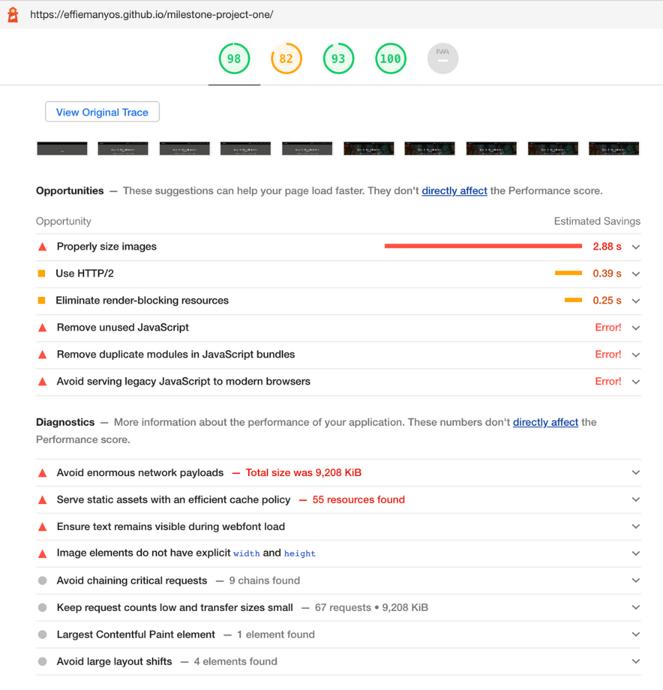
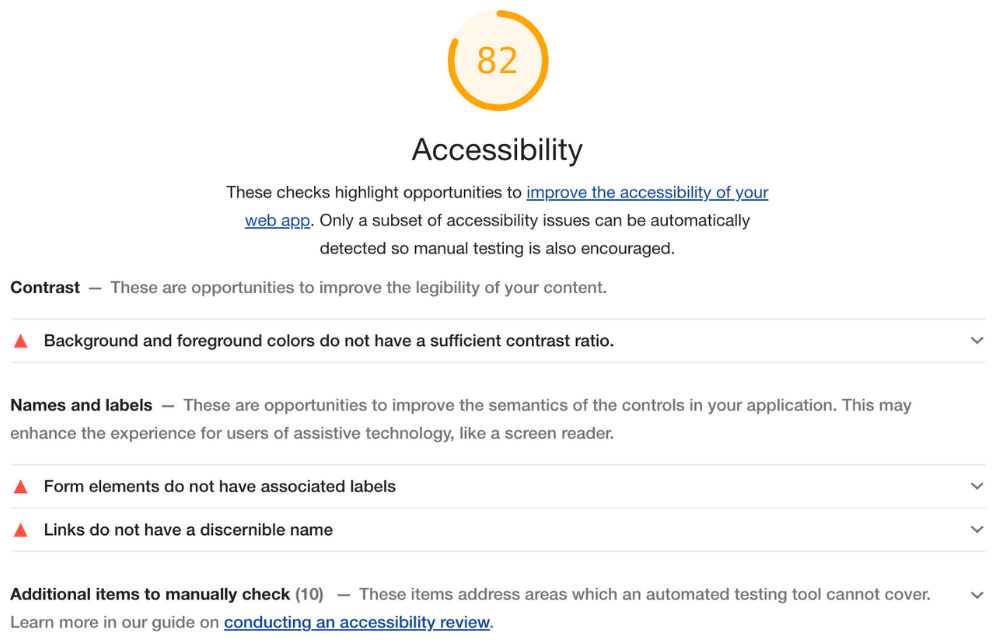

# **TESTING**

The website was tested in the following browsers:

- Chrome √
- Firefox
- Microsoft Edge
- Brave
- Safari √
- Internet Explorer
- Opera √
- Chromium

It was also tested in the following phone operating systems:

- iOS
- Android
- 

Finally, it was tested in the following mobile devices:

- 
- 
- 
- 
- 

*Results:* 

The webiste had an optimal performance and could be used perfectly, no funcional issues were found during the testing. The visual layout was not the exactly the same in all systems but the users could interact with ease and achieve their goals successfully.

## **Issues Solved During Development**
-----

- ONE

- TWO

- THREE

- FOUR

- FIVE

- SIX

- SEVEN

- EIGHT

- NINE

- TEN

## **HTML/CSS Validation Testing**
-----

### **1. HTML Validation**

The tool used for this code validation was the [W3C Markup Validation Service](https://validator.w3.org/), which was used by **Direct Input** to make sure there were no erros in the **HTML File**. The results were the following:

 

***Date:*** Thursday, Feb 25th, 2021

- **Issue:** Bad value "mailto: effie@gmail.com" for attribute `href` on element `a`: Illegal character in scheme data: **space is not allowed**.

- **Fixes:** All the extra spaces were removed resulting in:

```HTML
<p><a href="mailto:effie@gmail.com">effie@gmail.com</a></p>
```

The final report shows no errors in the index.html file as they were properly fixed:

 

***Date:*** Thursday, Feb 25th, 2021

### **2. CSS Validation**

The tool used for this code validation was the [W3C CSS Validation Service](https://jigsaw.w3.org/css-validator/), which was used by **Direct Input** to make sure there were no erros in the **CSS Style Sheet**. The results were the following:

 

***Date:*** Thursday, Feb 25th, 2021

The CSS yielded no errors, so I proceeded with further testing. However, it is worth noting that I also got these five warning results to be considered:

 

Just in case, I redid the testing by **File Upload** and the results were exactly the same. 

## **Testing Performance**
-----

In order to test the website's performance on desktop and mobile, [Google Lighthouse](https://developers.google.com/web/tools/lighthouse) was used.

### **1. Desktop**

The initial results were the following:

 

 

 

 

 

***Date:*** Thursday, Feb 25th, 2021

The following actions were taken to improve the performance of the website, especially the accessibility:

**Urgent Issues:**

**1. Issue:** Remove unused JavaScript

- **Fixes:**

**2. Issue:** Properly size images / Avoid enourmous network payloads

- **Fixes:** Unfortunatly, due to the lack of time this issue cannot be solved before the project deadline. However, all the images used on the website will be converted from PNG to formats like JPEG 2000 or WebP to provide better compression for faster downloads and less data consumption. The tools that will be used for this are the following: [Convertio (PNG to WebP)](https://convertio.co/png-webp/) and [TinyPNG (Image Compression)](https://tinypng.com/).

**3. Issue:** Links to cross-origin destinations are unsafe

- **Fixes:** This issue was simply fixed by adding `rel="noopener"` to all external links to prevent security vulnerabilities.

```HTML
<li>
    
    <a href="https://archhyve.com/" target="_blank" rel="noopener"></a>
</li>
```

**4. Issue:** Image elements do not have explicit widh and height

- **Fixes:**

**5. Issue:** Background and foreground colors do not have a sufficient contrast ratio √

- **Fixes:** This issue was simply fixed by increasing the contrast of the colors in the background and foreground.

```CSS
#new-bgfg-colors {
    background: #e7e8ef;
    color: #434343;
}
```
*Final Result:*
 

**6. Issue:** Ensure text ramains visible during webfont load

- **Fixes:**

**7. Issue:** Form elements do not have associated labels

- **Fixes:** This issue was simply fixed by adding the associated labels to all form elements.

```HTML
<!-- Name -->
<label for="fullname">Full Name</label>
<input type="text" name="name" id="fullname" class="form-control" placeholder="Full Name" required/>
```

```CSS
/* Invisible Form Labels */
label {
    display: none;
}
```

*Final Result:*


**8. Issue:** Links do not have a discernible name

- **Fixes:**

### **1. Mobile**

The initial results were the following:

 


## **Testing Accessibility**
-----


## **Testing User Stories**
-----


