# **Content** 

- [Testing](#testing "Testing")
  - [Issues Solved During Development](#issues-solved-during-development "Issues Solved During Development")
  - [HTML-CSS Validation Testing](#html-css-validation-testing "HTML-CSS Validation Testing")
  - [Testing Performance](#testing-performance "Testing Performance")
  - [Testing Accessibility](#testing-accessibility "Testing Accessibility")
  - [Testing User Stories](#testing-user-stories "Testing User Stories")
  - [Code Institute Peer Code Review](#code-institute-peer-code-review "Code Institute Peer Code Review")

# **TESTING**

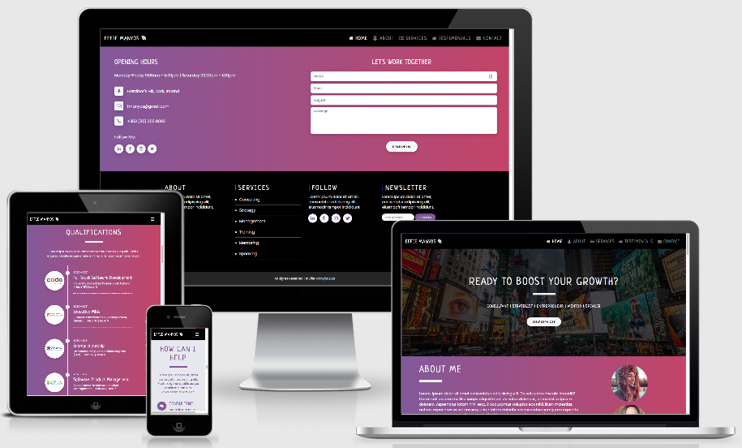

The website was tested in the following **browsers**:

- Chrome √
- Firefox √
- Microsoft Edge √
- Safari √
- Internet Explorer X
- Opera √

It was also tested in the following phone **operating systems**:

- iOS √
- Android √

Finally, it was tested in the following **devices**:

- Desktop √
- iPhone 5/SE √
- Pixel 2/2XL √
- Moto 4G √
- Galaxy S5 √
- iPhone 6/7/8 (+Plus) √
- iPhone X/iPhone XS Max √
- iPad/iPad Pro √
- Surface Duo √

*Results:* 

The website had an great performance and could be used perfectly, no funcional issues were found during the testing. However, the layout was not exactly the same (or the intended design) in all systems and devices but the users could interact with ease and achieve their goals successfully.

## **Issues Solved During Development**
-----

The most important issues that were found during development that took a considered amount to time to solve are the following:

- ONE

- TWO

- THREE

- FOUR

- FIVE

[Back to Content](#content)

## **HTML-CSS Validation Testing**
-----

### **1. HTML Validation**

The tool used for this code validation was the [W3C Markup Validation Service](https://validator.w3.org/), which was used by **Direct Input** to make sure there were no erros in the **HTML File**. The results were the following:

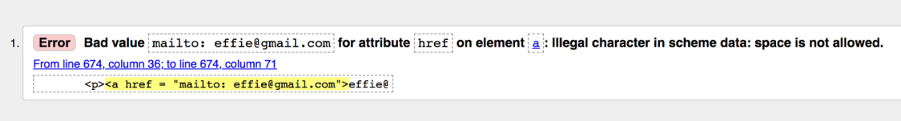 

***Date:*** Thursday, Feb 25th, 2021

**1. Issue:** Bad value "mailto: effie@gmail.com" for attribute `href` on element `a`: Illegal character in scheme data: **space is not allowed**.

- **Fixes:** All the extra spaces were removed resulting in:

```HTML
<p><a href="mailto:effie@gmail.com">effie@gmail.com</a></p>
```

The **final report** shows no errors in the index.html file as they were properly fixed:

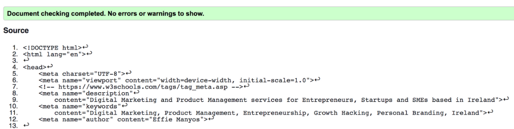 

***Date:*** Thursday, Feb 25th, 2021

### **2. CSS Validation**

The tool used for this code validation was the [W3C CSS Validation Service](https://jigsaw.w3.org/css-validator/), which was used by **Direct Input** to make sure there were no erros in the **CSS Style Sheet**. The results were the following:

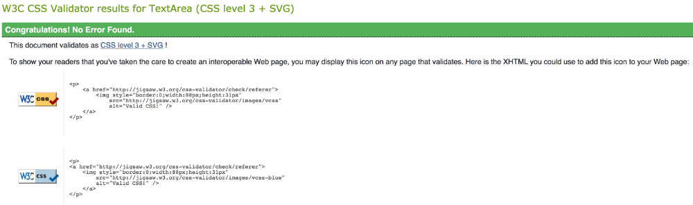 

***Date:*** Thursday, Feb 25th, 2021

The CSS yielded no errors, so I proceeded with further testing. However, it is worth noting that I also got these five warning results to be considered:

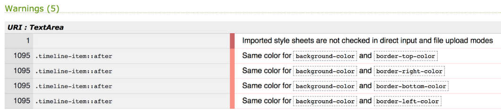 

Just in case, the testing was done again, this time by **File Upload**, and the results were exactly the same. 

## **Testing Performance**
-----

In order to test the website's performance on **desktop** and **mobile**, [Google Lighthouse](https://developers.google.com/web/tools/lighthouse) was used in both cases.

### **Desktop & Mobile**

The **initial results** were the following:

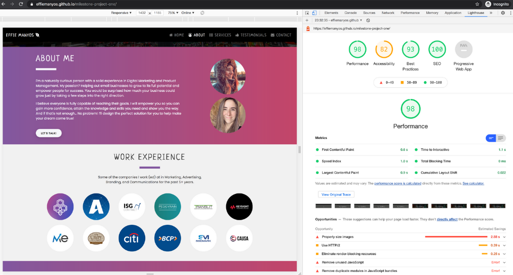 

 

 

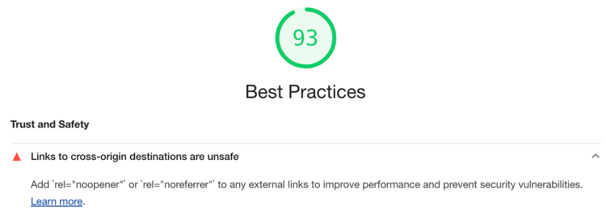 

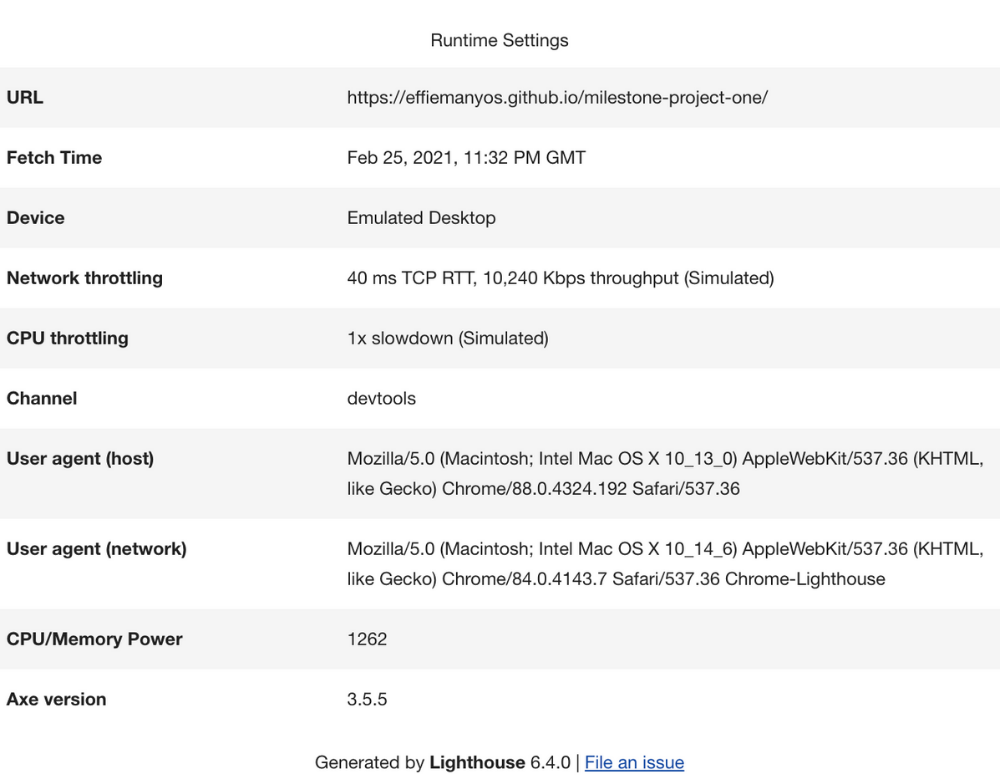 

***Date:*** Thursday, Feb 25th, 2021

The following actions were taken to improve the performance of the website, especially the accessibility:

**Urgent Issues:**

**1. Issue:** Properly size images / Avoid enourmous network payloads

- **Fixes:** Unfortunatly, due to the lack of time this issue could not be solved before the project deadline. However, all the images used on the website will be converted from PNG to formats like JPEG 2000 or WebP to provide better compression for faster downloads and less data consumption. The tools that will be used for this are the following: [Convertio (PNG to WebP)](https://convertio.co/png-webp/) and [TinyPNG (Image Compression)](https://tinypng.com/). **Goal:** Less than 550KB per image.

**2. Issue:** Links to cross-origin destinations are unsafe

- **Fixes:** This issue was simply fixed by adding `rel="noopener"` to all external links to prevent security vulnerabilities.

```HTML
<li>
    
    <a href="https://archhyve.com/" target="_blank" rel="noopener"></a>
</li>
```

**3. Issue:** Image elements do not have explicit widh and height

- **Fixes:** Unfortunatly, due to the lack of time this issue could not be solved before the project deadline. However, explicit `width` and `height` (size attributes) will be set on image and video elements to reduce layout shifts and improve CLS (Cumulative Layout Shift) like explained in [Optimize Cumulative Layout Shift](https://web.dev/optimize-cls/?utm_source=lighthouse&utm_medium=devtools#images-without-dimensions).

*Example:*
```HTML

```

**4. Issue:** Background and foreground colors do not have a sufficient contrast ratio √

- **Fixes:** This issue was simply fixed by increasing the contrast of the colors in the background and foreground.

```CSS
#new-bgfg-colors {
    background: #e7e8ef;
    color: #434343;
}
```
*Final Result:*
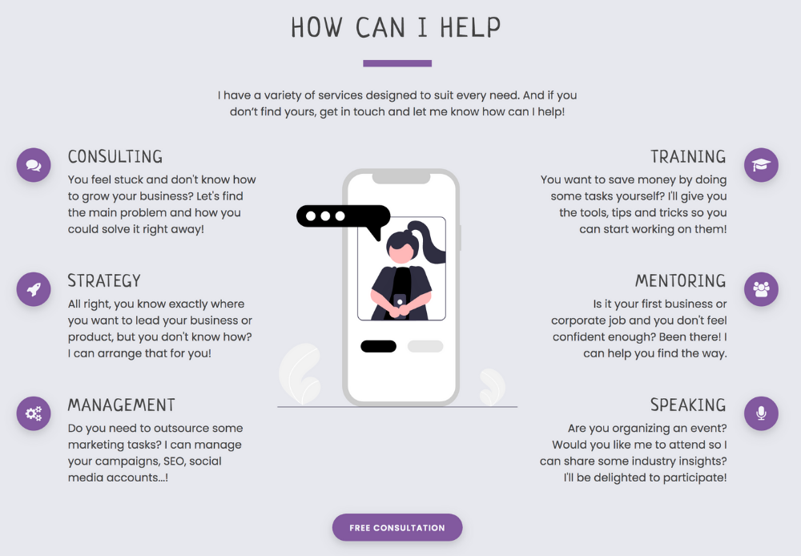 

**5. Issue:** Ensure text ramains visible during webfont load

- **Fixes:**

**6. Issue:** Form elements do not have associated labels

- **Fixes:** This issue was simply fixed by adding the associated labels to all form elements.

```HTML
<!-- Name -->
<label for="fullname">Full Name</label>
<input type="text" name="name" id="fullname" class="form-control" placeholder="Full Name" required/>
```

```CSS
/* Invisible Form Labels */
label {
    display: none;
}
```

*Final Result:*

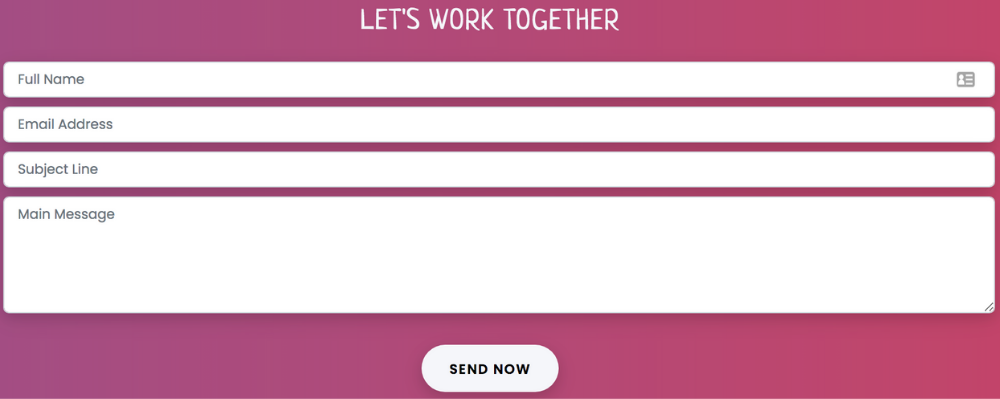

*Final Results:*

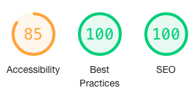

[Back to Content](#content)

## **Testing Accessibility**
-----

To test the website accessibility [Wave Web Accessibility Evaluation Tool](https://wave.webaim.org/) was used. The obtained results are the following:

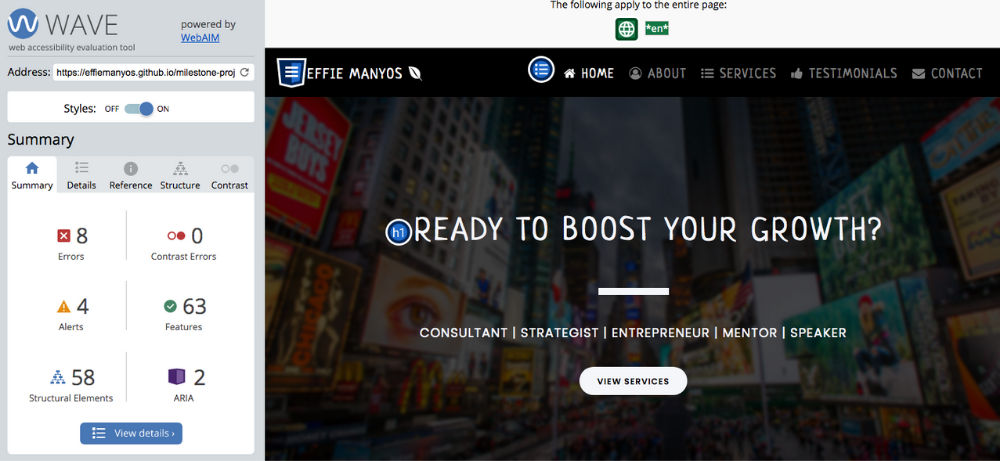 

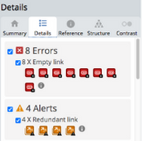

All "errors" and "alerts" were analysed in detail and the **conclusions** were the following: 

- All the **alerts** were actually made on purpose for academic reasons only as the external links used in the development of this project are not the real ones (e.g.: social media links) or they have been duplicated as the information shared on the site requires:

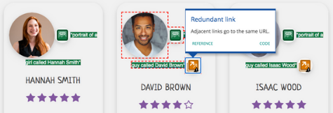

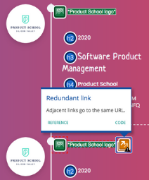

- All these **errors** on the site are the same, the `<a>` tag doesn't contain any text: 

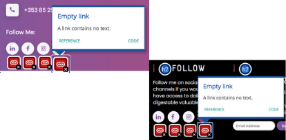

In order to fix this to improve the accessibility of the website, `alt text` was added to all social media icons so that the text can be detected by screen readers only:

```HTML
<!-- Hidden Text Social Media Icons | SR Only -->
<a href="https://www.linkedin.com/" target="_blank" rel="noopener"><i class="fa fa-linkedin"><span class="sr-only">LinkedIn</span></i></a>
<a href="https://www.facebook.com/" target="_blank" rel="noopener"><i class="fa fa-facebook"><span class="sr-only">Facebook</span></i></a>
<a href="https://www.instagram.com/" target="_blank" rel="noopener"><i class="fa fa-instagram"><span class="sr-only">Instagram</span></i></a>
<a href="https://twitter.com/" target="_blank" rel="noopener"><i class="fa fa-twitter"><span class="sr-only">Twitter</span></i></a>
```

```CSS
/* Hidden Text Social Media Icons | SR Only */
.sr-only {
    font-size: 0;
    height: 1px;
    overflow: hidden;
    display: block;
}
```

> Credit: ["Add Text Alternate to Social Media Icons" by Sylvia Pellicore](https://github.com/girldevelopit/gdi-website/issues/344)

*Final Results:*

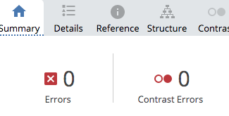

[Back to Content](#content)

## **Testing User Stories**
-----

1. XXX
2. XXX
3. XXX
4. XXX
5. XXX
6. XXX
7. XXX
8. XXX
9. XXX
10. XXX

[Back to Content](#content)

## **Code Institute Peer-Code-Review**
-----

- **Sean McMahon:** "Beautiful design and very consistent. I really like the transitions on the company logos."
- **Francis Kershaw:** "This is so good, Effie! Can tell how hard you've worked on it, well done!"
- **Janelle MacMillan:** "I think this looks great, Effie, and I really can't find anything other than that to say about it."
- **Michael Nota Rita:** "It looks great! 5 stars for me!"

Unfortunatly, there were no constructive feedback to work on in order to improve user experience despite it was requested twice.

- **Cormac Lawlor:** "That's super impressive! Love it. One thing, your images like your hero are massive! It's slowing down your site. Might be worth reducing the file size."

[Back to Content](#content)

[Return to README.md Document](https://github.com/effiemanyos/milestone-project-one/blob/master/README.md)